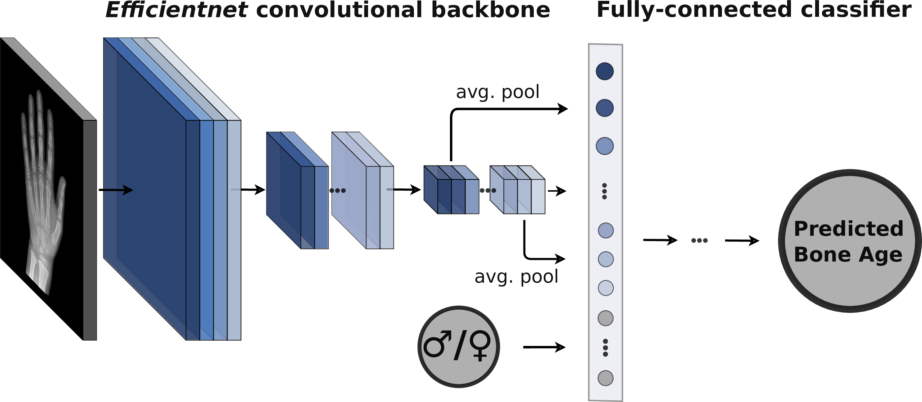

# Deeplasia
# Prior-free deep learning for pediatric bone age assessment robust to skeletal dysplasias

[](https://github.com/psf/black)
&nbsp; &nbsp; [](http://creativecommons.org/licenses/by-nc/4.0/)

This repo contains the code for the paper <TODO: add link to paper>.

The models were trained on the [RSNA Pediatric Bone Age Dataset](https://www.kaggle.com/datasets/kmader/rsna-bone-age).
The dataset contains ca. 14,200 images of the hand and wrist of children, with ages ranging from 0 to 18 years.

The models consist of a convolutional backbone (*efficientnet* or *inception-v3*) and a fully connected classifier performing the regression of the bone age.



Usually the model takes the sex as additional input. However it can also be trained to predict the sex in addition to the bone age as multi-task learning (MTL).

## Installation

To install the necessary dependencies, run:
```bash
$ pip install -r requirements.txt
```
For GPU acceleration using CUDA, you need to install the CUDA 11.3+ versions of `torch` and `torchvision`:

```
torch==1.10.2+cu113
torchvision==0.11.3+cu113
```

Please refer to the official [PyTorch installation guide](https://pytorch.org/get-started/locally/) for more details.

## Data

The [RSNA Pediatric Bone Age Dataset](https://www.kaggle.com/datasets/kmader/rsna-bone-age) and the [Los Angeles Digital Hand Atlas](https://ipilab.usc.edu/research/baaweb/) are publicly available for training and testing.

### Annotation formatting

To assert compatibility with varying data sources the original annotations of the RSNA dataset are converted to common `.csv` file containing the annotations from all subsets.
An example of the annotations file containing the [RSNA Pediatric Bone Age Dataset](https://www.kaggle.com/datasets/kmader/rsna-bone-age) and the [Los Angeles Digital Hand Atalas](https://ipilab.usc.edu/research/baaweb/) (DHA)  can be found in `data/annotations.csv`.

The hand masks are available from [zenodo](https://doi.org/10.5281/zenodo.7415591).

### Splits

The `data/splits` folder contains `.csv` files defining the splits of the corresponding data sets.
Hereby, the patient IDs match the splits to the corresponding patients in the annotations file.
So far, files for the original RSNA competition on kaggle and the DHA as test set is available.

## Inference

For batched predictions, use the `predict.py` script; e.g. to test a model on the DHA, run:

```bash
$ python predict.py \
    --ckp_path=<path/to/checkpoint.ckpt> \
    --gpus=1 \
    --annotation_csv=data/annotation.csv \
    --split_csv=data/splits/la_dha_test.csv \
    --split_column="test" \
    --split_name="test" \
    --mask_crop_size=1.15 \
    --num_workers=8 \
    [...]
````

See also the [streamlit app](https://github.com/igsb/bone-age-streamlit) for interactive inference.

## Training

An exemplary training can be started with:

``` bash
$ python train_model.py \
    --config=configs/cosine_annealing.yml \
    --trainer.max_epochs=100 \
    --model.backbone=efficientnet-b4 \
    --data.annotation_df=data/annotations.csv \
    --data.num_workers=8 \
    --data.train_batch_size=32 \
    --data.test_batch_size=48 \
    [...]
```

### Logging

Per default, logs are written to `run.log`.
To specify a different path, run the script with the `$LOG_FILE` environment variable:

``` bash
$ LOG_FILE=<path/to/log_file.txt> python train_model.py [...]
```

### Flags and options

For all options, check the `lib/datasets.py` and `lib/models.py` files or type

```bash
$ python train_model.py -h
```

to obtain an overview of all flags and options.
Note that for bundling jointly used options (e.g. for training on a certain device) it is possible to create a special config and add it as `--config=/path/to/config.yml` flag.

For general training options (i.e. everything except the model and data options) check the *pytorch-lightning* [documentation](https://pytorch-lightning.readthedocs.io/en/latest/common/trainer.html).

### Settings sex as input or output

The following configurations are available:
 * Use the sex as input (`configs/sex_input.yml`, as the default configuration)
 * Predict the sex explicitly (i.e. in separate classifier) in an MTL setting (`configs/explicit.yml`). Hereby
   * either the predicted sex can be used for the age prediction (`--model.correct_predicted_sex=False`)
   * or the ground truth sex can be used for age prediction during training (`--model.correct_predicted_sex=True`, default)
 * Aim to predict the sex implicitly (i.e. without a separate classifier) in an MTL setting (`configs/implicit.yml`)
 * Predict only the sex and ignore the bone age (`configs/sex_only.yml`)

### Training via SLURM
A template for a SLURM training job is available at `bash/slurm_job_example.sh`.


# Citation
Rassmann et al. 2023
